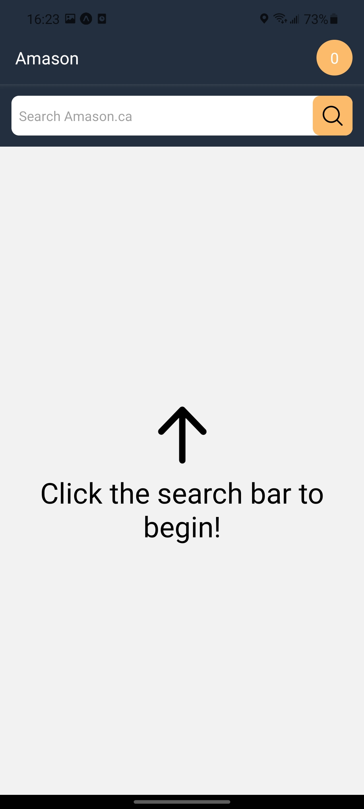
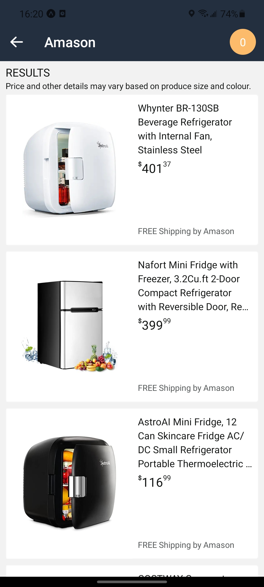
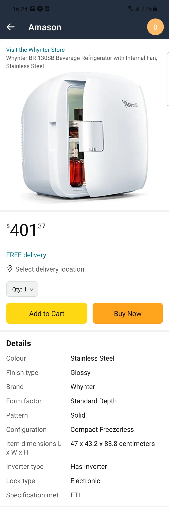
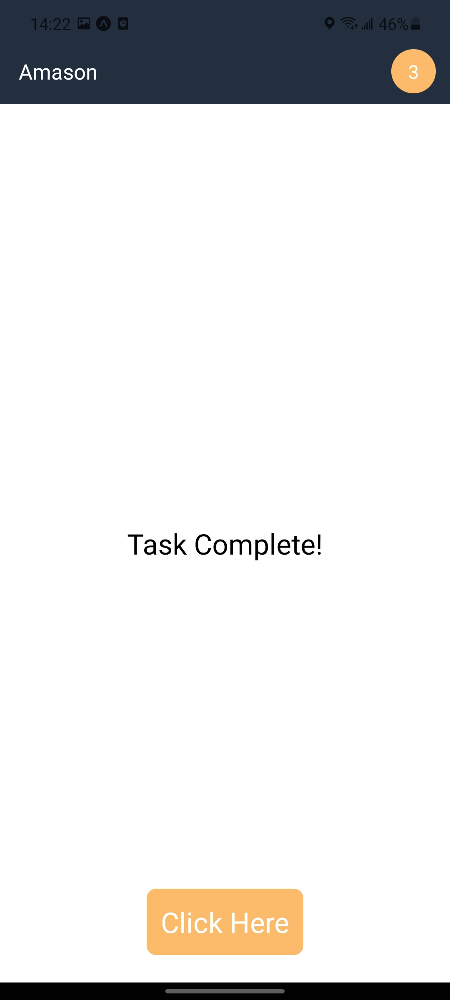
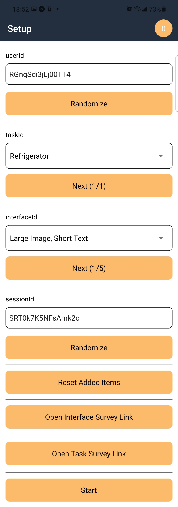

# Recommender System UI
This project is a prototype for evaluating the effects different interfaces in recommender systems for mobile devices. 

  <!-- iOS -->
  
  <!-- Android -->
  
  <!-- Web -->
  

  
  
  
  
  

## Related repositories

- [recommender-system-analysis](https://github.com/justinsj/recommender-system-analysis): Scripts to perform metric computations 
- [recommender-system-scraper](https://github.com/justinsj/recommender-system-scraper): Scripts to obtain data from Amazon

## 🚀 How to use

- Install with `yarn` or `npm install`.
- Run `expo start` to try it out.
- Install `expo go` on your phone and then use the QR code to load the app. You may need to use Connection: Tunnel.

## 📝 Notes

This app logs interactions to an AWS DynamoDB.
Press the title in the header `6 times in 2 seconds` to enter the `Setup Screen`.

